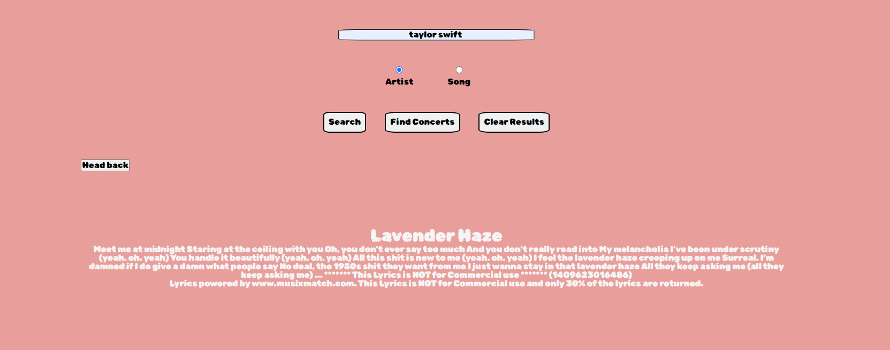

### EAR WORM
Welcome to Ear Worm, the ultimate app for finding the lyrics to your favorite songs! With Earworm, you can easily search for the lyrics you are looking for in any song, and even the album for that song!

## How it Works!!
To search for song or artist, simply enter the song or artist into the search bar and hit "Search". You will then be taken to a page with the top 50 results for that artist or song. Then you can click the one you're looking for and then find the lyrics! 

## Lessons Learned
We learned alot during the process of making this project. 
We learned about time managment. Learning to deal with different schedules. 
We also learned about the struggles of API.

## Acceptance criteria
WHEN I launch the page , I will be presented with a page to search for either an artist or song
THEN I will be able to click on the artist/song, in order to see all the albums/tracks they are included in
WHEN I search for a artist, by searching.
THEN I am presented with a list of albums from the artist I have selected
WHEN I click on a particular albums.
THEN I am presented with a detailed view of the of the lyrics for that song.

### Credits
Project Manager = Austin McClarren 
● Lead Designer  = Courtney Gochenour
● Support Designer =  Frankie Sanchez
● Lead API Engineer = Max Fell
● Support API Engineer = Thomas Bailey
● Testing/Support = Everyone

### APIs Used
GoogleAPI
MusixMatchAPI
BandsintownAPI

## Additonal Resources
-Google
-StackOverflow
-Classmates

## Tech Stack

**FRONTEND:** HTML, CSS, JAVASCRIPT

## Documentation

[MusixMatch](https://developer.musixmatch.com/documentation/api-reference/track-lyrics-get)
[Google Maps](https://mapsplatform.google.com/maps-products/dynamic-maps/?utm_source=search&utm_medium=googleads&utm_campaign=brand_core_exa_desk_mobile_us&gclid=CjwKCAiAwc-dBhA7EiwAxPRylC0EHfED0nteKrOpo_8-ibhUmbmIC3H0CkdUp9UF3oUZWXo84bA_RhoCDQEQAvD_BwE&gclsrc=aw.ds)
[Bands In Town](https://artists.bandsintown.com/support/api-installation)

## Screenshots

### MIT License

Copyright (c) 2022 Ear Worm

Permission is hereby granted, free of charge, to any person obtaining a copy
of this software and associated documentation files (the "Software"), to deal
in the Software without restriction, including without limitation the rights
to use, copy, modify, merge, publish, distribute, sublicense, and/or sell
copies of the Software, and to permit persons to whom the Software is
furnished to do so, subject to the following conditions:

The above copyright notice and this permission notice shall be included in all
copies or substantial portions of the Software.

THE SOFTWARE IS PROVIDED "AS IS", WITHOUT WARRANTY OF ANY KIND, EXPRESS OR
IMPLIED, INCLUDING BUT NOT LIMITED TO THE WARRANTIES OF MERCHANTABILITY,
FITNESS FOR A PARTICULAR PURPOSE AND NONINFRINGEMENT. IN NO EVENT SHALL THE
AUTHORS OR COPYRIGHT HOLDERS BE LIABLE FOR ANY CLAIM, DAMAGES OR OTHER
LIABILITY, WHETHER IN AN ACTION OF CONTRACT, TORT OR OTHERWISE, ARISING FROM,
OUT OF OR IN CONNECTION WITH THE SOFTWARE OR THE USE OR OTHER DEALINGS IN THE
SOFTWARE.